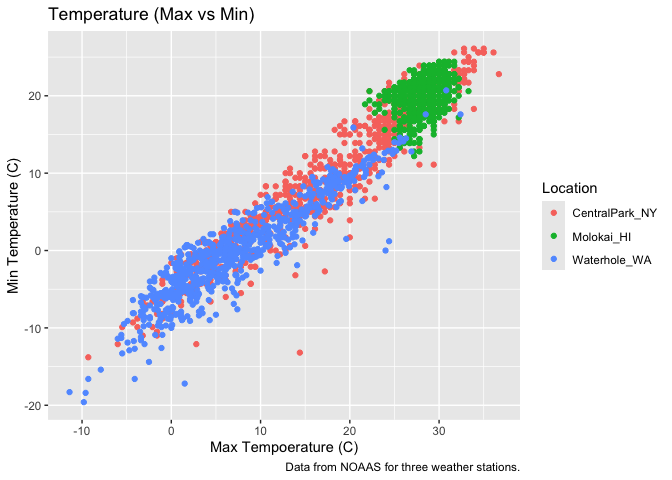
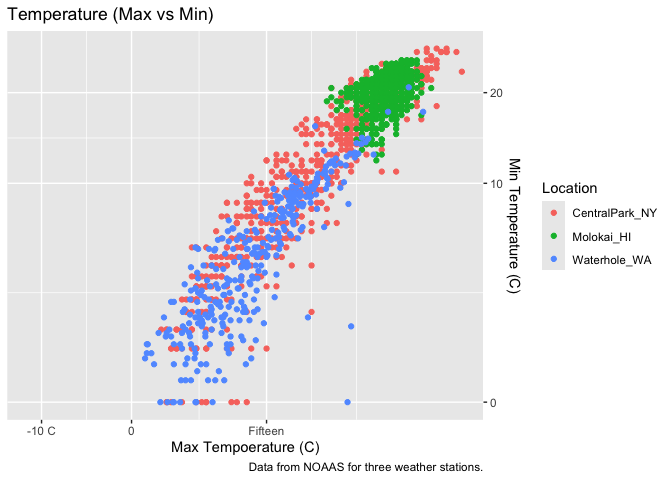
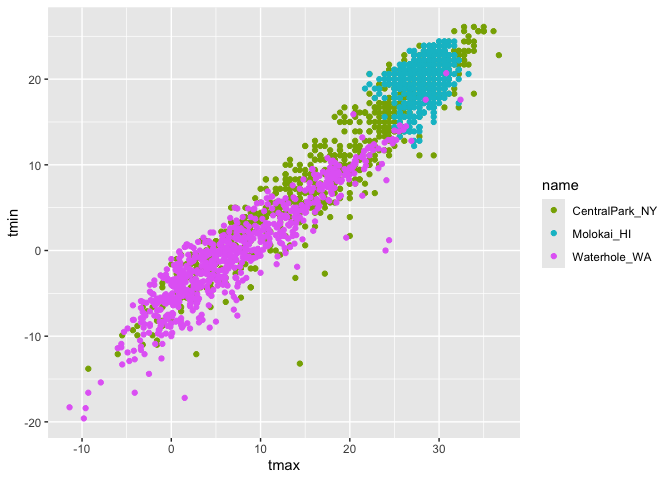
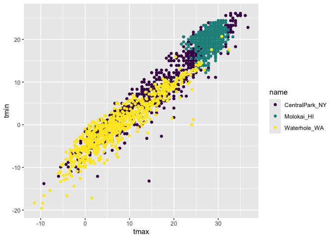

02_viz
================
Lauren Littig
2026-10-06

``` r
library(tidyverse)
```

    ## ── Attaching core tidyverse packages ──────────────────────── tidyverse 2.0.0 ──
    ## ✔ dplyr     1.2.1     ✔ readr     2.2.0
    ## ✔ forcats   1.0.1     ✔ stringr   1.6.0
    ## ✔ ggplot2   4.0.3     ✔ tibble    3.3.1
    ## ✔ lubridate 1.9.5     ✔ tidyr     1.3.2
    ## ✔ purrr     1.2.2     
    ## ── Conflicts ────────────────────────────────────────── tidyverse_conflicts() ──
    ## ✖ dplyr::filter() masks stats::filter()
    ## ✖ dplyr::lag()    masks stats::lag()
    ## ℹ Use the conflicted package (<http://conflicted.r-lib.org/>) to force all conflicts to become errors

``` r
library(p8105.datasets)

data("weather_df")
```

Now we have everythign we need!

``` r
weather_df |> 
  ggplot(aes(x = tmax, y = tmin, color = name)) +
  geom_point() +
  labs(
    title = "Temperature (Max vs Min)",
    x = "Max Tempoerature (C)",
    y = "Min Temperature (C)",
    color = "Location",
    caption = "Data from NOAAS for three weather stations."
  )
```

    ## Warning: Removed 17 rows containing missing values or values outside the scale range
    ## (`geom_point()`).

<!-- -->

Now lets try some other scales.

``` r
weather_df |> 
  ggplot(aes(x = tmax, y = tmin, color = name)) +
  geom_point() +
  labs(
    title = "Temperature (Max vs Min)",
    x = "Max Tempoerature (C)",
    y = "Min Temperature (C)",
    color = "Location",
    caption = "Data from NOAAS for three weather stations."
  ) +
  scale_x_continuous(
    breaks = c(-10, 0, 15),
    labels = c("-10 C", "0", "Fifteen")
  ) +
  scale_y_continuous(
    trans = "sqrt",
    position = "right"
  )
```

    ## Warning in transformation$transform(x): NaNs produced

    ## Warning in scale_y_continuous(trans = "sqrt", position = "right"): sqrt
    ## transformation introduced infinite values.

    ## Warning: Removed 520 rows containing missing values or values outside the scale range
    ## (`geom_point()`).

<!-- -->

Let’s look at color!!!

``` r
weather_df |> 
  ggplot(aes(x = tmax, y = tmin, color = name)) +
  geom_point() +
  scale_color_hue(h = c(100, 300))
```

    ## Warning: Removed 17 rows containing missing values or values outside the scale range
    ## (`geom_point()`).

<!-- -->

Color-blind friendly:

``` r
weather_df |> 
  ggplot(aes(x = tmax, y = tmin, color = name)) +
  geom_point() +
  viridis::scale_color_viridis(
    discrete = TRUE
  )
```

    ## Warning: Removed 17 rows containing missing values or values outside the scale range
    ## (`geom_point()`).

<!-- -->
