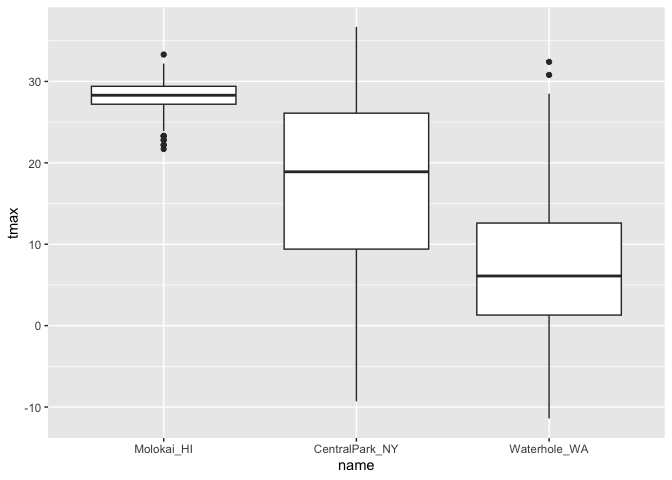
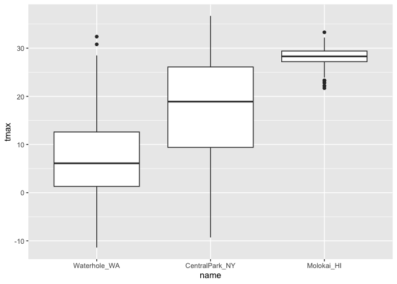
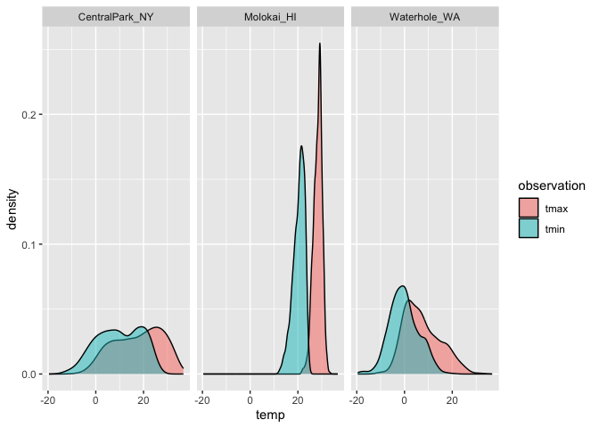
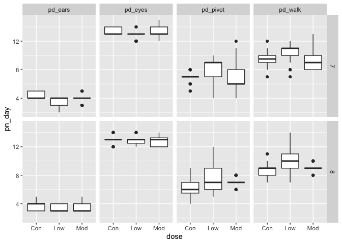

02_viz
================
Lauren Littig
2026-10-06

``` r
library(tidyverse)
```

    ## ── Attaching core tidyverse packages ──────────────────────── tidyverse 2.0.0 ──
    ## ✔ dplyr     1.2.1     ✔ readr     2.2.0
    ## ✔ forcats   1.0.1     ✔ stringr   1.6.0
    ## ✔ ggplot2   4.0.3     ✔ tibble    3.3.1
    ## ✔ lubridate 1.9.5     ✔ tidyr     1.3.2
    ## ✔ purrr     1.2.2     
    ## ── Conflicts ────────────────────────────────────────── tidyverse_conflicts() ──
    ## ✖ dplyr::filter() masks stats::filter()
    ## ✖ dplyr::lag()    masks stats::lag()
    ## ℹ Use the conflicted package (<http://conflicted.r-lib.org/>) to force all conflicts to become errors

``` r
library(p8105.datasets)
library(patchwork)

data("weather_df")
```

Now we have everythign we need!

``` r
weather_df |> 
  ggplot(aes(x = tmax, y = tmin, color = name)) +
  geom_point() +
  labs(
    title = "Temperature (Max vs Min)",
    x = "Max Tempoerature (C)",
    y = "Min Temperature (C)",
    color = "Location",
    caption = "Data from NOAAS for three weather stations."
  )
```

    ## Warning: Removed 17 rows containing missing values or values outside the scale range
    ## (`geom_point()`).

<!-- -->

Now lets try some other scales.

``` r
weather_df |> 
  ggplot(aes(x = tmax, y = tmin, color = name)) +
  geom_point() +
  labs(
    title = "Temperature (Max vs Min)",
    x = "Max Tempoerature (C)",
    y = "Min Temperature (C)",
    color = "Location",
    caption = "Data from NOAAS for three weather stations."
  ) +
  scale_x_continuous(
    breaks = c(-10, 0, 15),
    labels = c("-10 C", "0", "Fifteen")
  ) +
  scale_y_continuous(
    trans = "sqrt",
    position = "right"
  )
```

    ## Warning in transformation$transform(x): NaNs produced

    ## Warning in scale_y_continuous(trans = "sqrt", position = "right"): sqrt
    ## transformation introduced infinite values.

    ## Warning: Removed 520 rows containing missing values or values outside the scale range
    ## (`geom_point()`).

<!-- -->

Let’s look at color!!!

``` r
weather_df |> 
  ggplot(aes(x = tmax, y = tmin, color = name)) +
  geom_point() +
  scale_color_hue(h = c(100, 300))
```

    ## Warning: Removed 17 rows containing missing values or values outside the scale range
    ## (`geom_point()`).

<!-- -->

Color-blind friendly:

``` r
weather_df |> 
  ggplot(aes(x = tmax, y = tmin, color = name)) +
  geom_point() +
  viridis::scale_color_viridis(
    discrete = TRUE
  )
```

    ## Warning: Removed 17 rows containing missing values or values outside the scale range
    ## (`geom_point()`).

<!-- -->

## Themes

``` r
weather_df |> 
  ggplot(aes(x = tmin, y = tmax, color = name)) +
  geom_point() +
  viridis::scale_color_viridis(
    name = "Location",
    discrete = TRUE
  ) +
  theme(legend.position = "bottom")
```

    ## Warning: Removed 17 rows containing missing values or values outside the scale range
    ## (`geom_point()`).

<!-- -->

Cool! Moves legend to bottom. adding theme_classic() is cool.

``` r
weather_df |> 
  ggplot(aes(x = tmin, y = tmax, color = name)) +
  geom_point() +
  viridis::scale_color_viridis(
    name = "Location",
    discrete = TRUE
  ) +
  theme_classic() +
  theme(legend.position = "bottom")
```

    ## Warning: Removed 17 rows containing missing values or values outside the scale range
    ## (`geom_point()`).

<!-- -->

``` r
weather_df |> 
  ggplot(aes(x = tmin, y = tmax, color = name)) +
  geom_point() +
  viridis::scale_color_viridis(
    name = "Location",
    discrete = TRUE
  ) +
  theme_minimal()
```

    ## Warning: Removed 17 rows containing missing values or values outside the scale range
    ## (`geom_point()`).

<!-- -->

Update the tmax vs date plot. Mine:

``` r
weather_df |>
  ggplot(aes(x = date, y = tmax, color = name)) +
  geom_point(aes(size = prcp), alpha = 0.7) +
  theme_classic() +
  theme(legend.position = "bottom")
```

    ## Warning: Removed 19 rows containing missing values or values outside the scale range
    ## (`geom_point()`).

<!-- -->

His:

``` r
weather_df |>
  ggplot(aes(x = date, y = tmax, color = name)) +
  geom_point() +
  geom_smooth(se = FALSE) +
  labs(
    title = "Seasonal trends in Max Temp",
    x = "Date",
    y = "Max Temp",
    caption = "Max daily temp in three weather stations in 2021 and 2022",
    color = "Location"
  ) +
  viridis::scale_color_viridis(
    discrete = TRUE
  ) +
  theme_minimal() +
  theme(legend.position = "bottom")
```

    ## `geom_smooth()` using method = 'loess' and formula = 'y ~ x'

    ## Warning: Removed 17 rows containing non-finite outside the scale range
    ## (`stat_smooth()`).

    ## Warning: Removed 17 rows containing missing values or values outside the scale range
    ## (`geom_point()`).

<!-- -->

## Two more weird but useful plot things:

``` r
central_park_df = 
  weather_df |> 
  filter(name == "CentralPark_NY")

molokai_df = 
  weather_df |> 
  filter(name == "Molokai_HI")

ggplot(molokai_df, aes(x = date, y = tmax, color = name)) +
  geom_point() +
  geom_line(data = central_park_df)
```

    ## Warning: Removed 1 row containing missing values or values outside the scale range
    ## (`geom_point()`).

<!-- -->

multiple panels with different plot types.. COOL!!!!!

``` r
ggp_tmax_tmin =
  weather_df |> 
  ggplot(aes(x = tmin, y = tmax, color = name)) +
  geom_point() +
  theme(legend.position = "none")

ggp_prcp_density =
  weather_df |> 
  filter(prcp > 0) |> 
  ggplot(aes(x = prcp, fill = name)) +
  geom_density(alpha = 0.5) +
  theme(legend.position = "none")

ggp_seasonal =
  weather_df |> 
  ggplot(aes(x = date, y = tmax, color = name)) +
  geom_point() +
  theme(legend.position = "bottom")

(ggp_tmax_tmin + ggp_prcp_density) / ggp_seasonal
```

    ## Warning: Removed 17 rows containing missing values or values outside the scale range
    ## (`geom_point()`).
    ## Removed 17 rows containing missing values or values outside the scale range
    ## (`geom_point()`).

<!-- -->

## Data manipulation

Start with facotrs.

boxplots!

``` r
weather_df |> 
  mutate(name = fct_relevel(name, c("Molokai_HI", "CentralPark_NY", "Waterhole_WA"))) |> 
  ggplot(aes(x = name, y = tmax)) +
  geom_boxplot()
```

    ## Warning: Removed 17 rows containing non-finite outside the scale range
    ## (`stat_boxplot()`).

<!-- -->

Reoder name variable according to another variable: Putting name in
order of median tmax. I like it!!

``` r
weather_df |> 
  mutate(name = fct_reorder(name, tmax)) |> 
  ggplot(aes(x = name, y = tmax)) +
  geom_boxplot()
```

    ## Warning: There was 1 warning in `mutate()`.
    ## ℹ In argument: `name = fct_reorder(name, tmax)`.
    ## Caused by warning:
    ## ! `fct_reorder()` removing 17 missing values.
    ## ℹ Use `.na_rm = TRUE` to silence this message.
    ## ℹ Use `.na_rm = FALSE` to preserve NAs.

    ## Warning: Removed 17 rows containing non-finite outside the scale range
    ## (`stat_boxplot()`).

<!-- -->

Make that distribution plot

``` r
weather_df |> 
  select(name, tmax, tmin) |> 
  pivot_longer(
    tmax:tmin,
    names_to = "observation",
    values_to = "temp"
  ) |> 
  ggplot(aes(x = temp, fill = observation)) +
  geom_density(alpha = 0.5) +
  facet_grid(.~name)
```

    ## Warning: Removed 34 rows containing non-finite outside the scale range
    ## (`stat_density()`).

<!-- -->

Make an FAS plot.

``` r
pups_df =
  read_csv(
    "data/FAS_pups.csv", skip = 3, na = c("", ".", "NA")) |> 
  janitor::clean_names()
```

    ## Rows: 313 Columns: 6
    ## ── Column specification ────────────────────────────────────────────────────────
    ## Delimiter: ","
    ## chr (1): Litter Number
    ## dbl (5): Sex, PD ears, PD eyes, PD pivot, PD walk
    ## 
    ## ℹ Use `spec()` to retrieve the full column specification for this data.
    ## ℹ Specify the column types or set `show_col_types = FALSE` to quiet this message.

``` r
litters_df =
  read_csv(
    "data/FAS_litters.csv", na = c("", ".", "NA")) |> 
  janitor::clean_names() |> 
  separate(group, into = c("dose", "day_of_tx"), 3)
```

    ## Rows: 49 Columns: 8
    ## ── Column specification ────────────────────────────────────────────────────────
    ## Delimiter: ","
    ## chr (2): Group, Litter Number
    ## dbl (6): GD0 weight, GD18 weight, GD of Birth, Pups born alive, Pups dead @ ...
    ## 
    ## ℹ Use `spec()` to retrieve the full column specification for this data.
    ## ℹ Specify the column types or set `show_col_types = FALSE` to quiet this message.

``` r
fas_df =
  left_join(pups_df, litters_df, by = "litter_number")

fas_df |> 
  select(dose, day_of_tx, starts_with("pd")) |> 
  pivot_longer(
    starts_with("pd"),
    names_to = "outcome",
    values_to = "pn_day"
  ) |> 
  drop_na() |> 
  ggplot(aes(x = dose, y = pn_day)) +
  geom_boxplot() +
  facet_grid(day_of_tx ~ outcome)
```

<!-- -->
